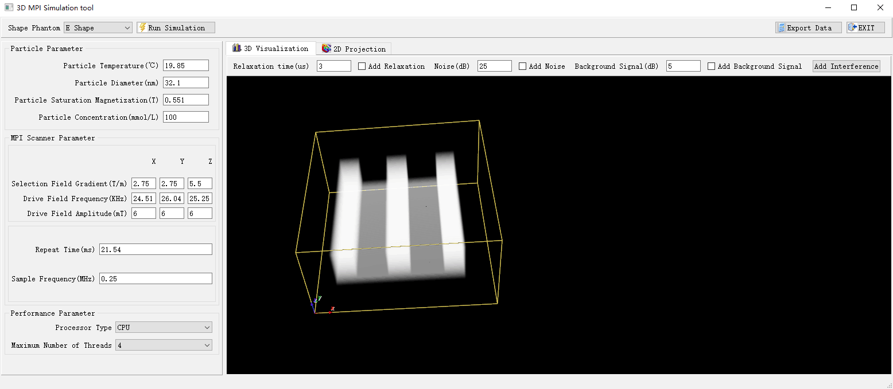
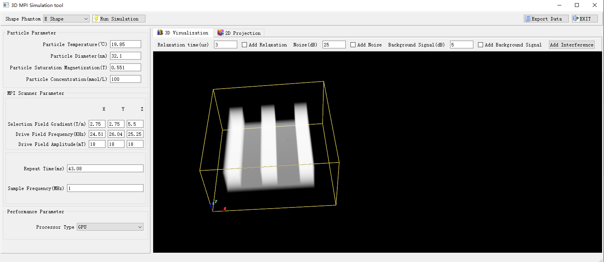

# Three-dimensional Magnetic Particle Imaging Simulation Tool

## INTRODUCTION

**See the link for the latest framework code:[http://mpilab.net/en/simulation/](http://mpilab.net/en/simulation/)**

The 3DMPISimulation is developed by Python 3.9. It is a reliable, high-performance and opened 3-D MPI simulation software tool based on x-space reconstruction method. The original 3-D phantom image can be reconstructed by the induced voltage signal simulated by the simulation tool through the x-space reconstruction method. The simulation tool can also simulate the interference for the reconstruction images of noise, background signals, and relaxation effects.
  
The current version provides two main function files: `mainCPU.py` and `mainGPU.py`. The speed-up of `mainCPU.py` is slower. We recommend running `mainGPU.py`.

**mainCPU.py** compiled into binary executable files in Windows system is provided.  

In Windows, clicking file **mainCPU.exe** to execute the binary files.  

In Windows system, the test of the `mainGPU.py` were performed using the following hardware:  
>**GPU NVIDIA GeForce GTX 2070 8G**

## ARCHITECTURE
  
Specifically see the paper: *A novel three-dimensional magnetic particle imaging simulation model for the quantitative evaluation of reconstruction images*

## INSTALLATION
  
The following dependent libraries need to be installed:

1.  `pip install numpy`
2.  `pip install scipy`
3.  `pip install pyqt5`
4.  `pip install matplotlib`
5.  `pip install pyqtchart`
6.  `pip install vtk`
7.  `pip install scipy-image`
8.  `pip install opencv-python`

To run `mainGPU.py`, you also need to install:

9.  `pip install pycuda`
10. Download **Visio Studio 2022 Community** and Install the component pointed by the red arrow
 

11. Add the `cl.exe` path(**Microsoft Visual Studio\2022\Community\VC\Tools\MSVC\14.29.30133\bin\Hostx64\x64**) to the system environment variables.

## RUNING THE EXAMPLE
  
1.  `python mainCPU.py`, the result of the runing is shown in the figure:

 

2.  `python mainGPU.py`, the result of the runing is shown in the figure:

 
